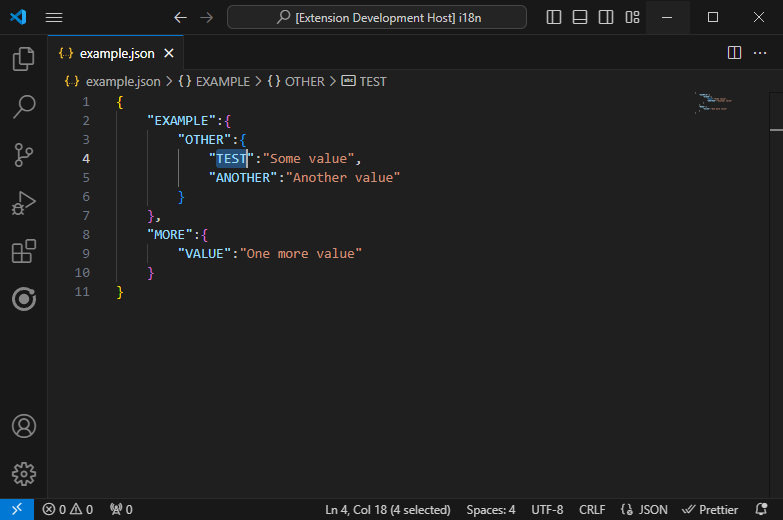

# A little helper for copy & past
This extension should make it easier to quickly copy the path for a STRING value of a JSON file.

## How to use
Select any key in your json (which has a STRING as value) and press one of the three keyboard shortcuts.

### For use in HTML
Shortcut: <kbd>Ctrl</kbd> + <kbd>Shift</kbd> + <kbd>C</kbd> 
Format: {{'**PATH**' | translate}} 
Example: {{'**EXAMPLE.OTHER.TEST**' | translate}}

### For use in TS
Shortcut: <kbd>Ctrl</kbd> + <kbd>Shift</kbd> + <kbd>X</kbd> 
Format: this.translate.instance('**PATH**') 
Format: this.translate.instance('**EXAMPLE.OTHER.TEST**')

### Only the path
Shortcut: <kbd>Ctrl</kbd> + <kbd>Shift</kbd> + <kbd>Y</kbd> 
Format: **PATH** 
Format: **EXAMPLE.OTHER.TEST**

## Limitations
- Works only for STRING values
- If Key and String has multible it will always select the first (even if selected the other one)